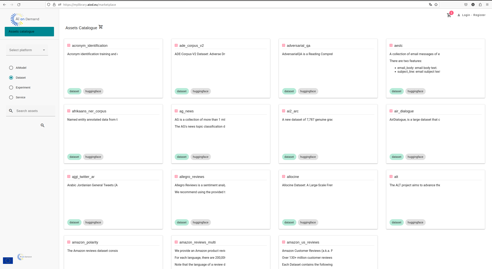
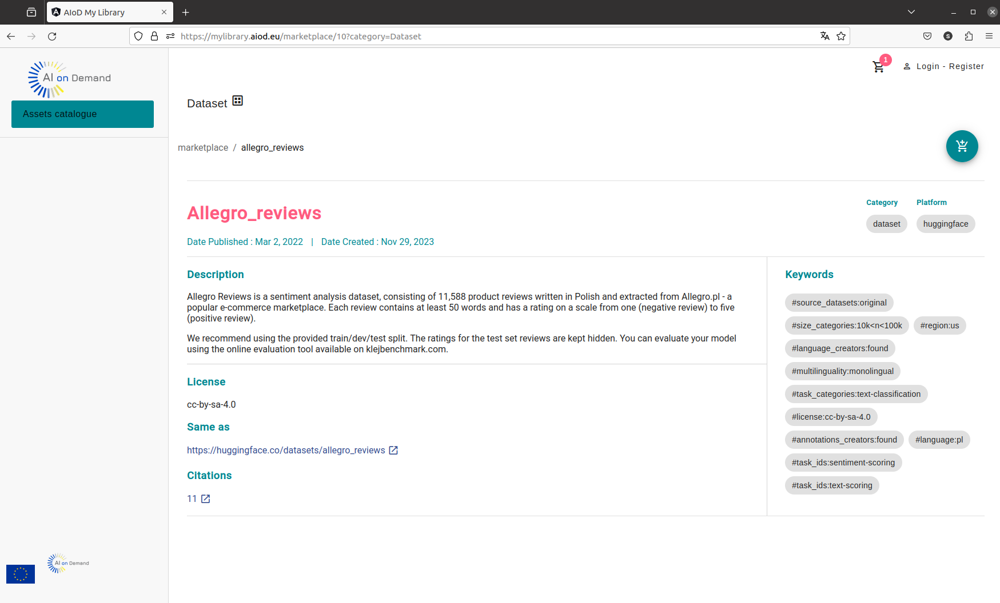
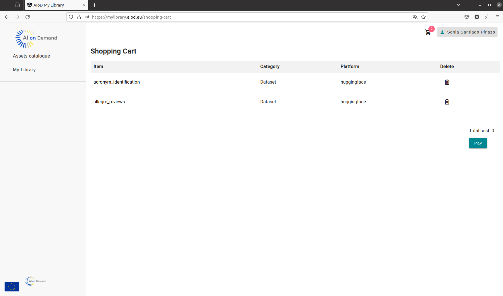
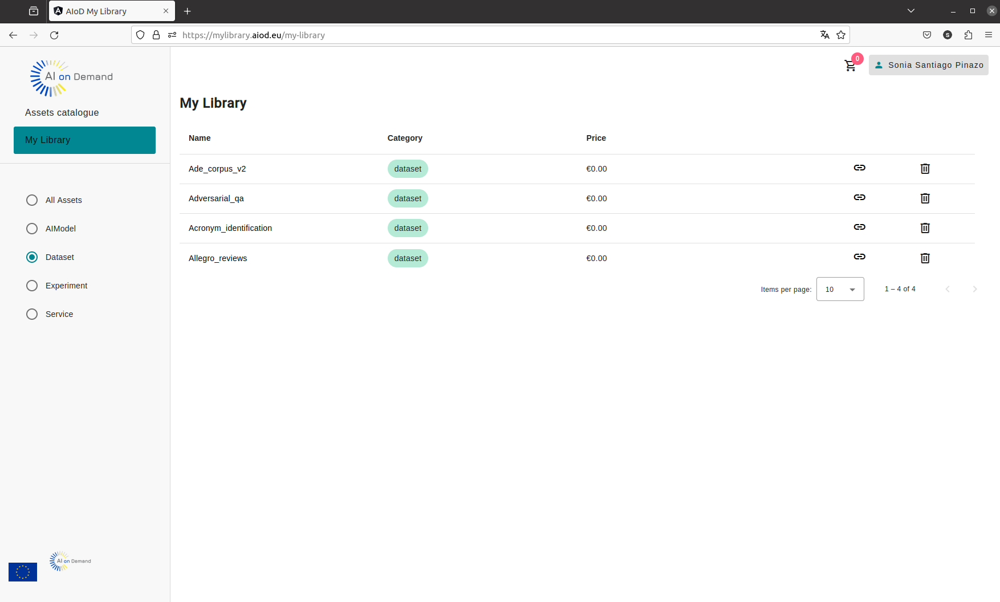

# AIoD My Library frontend

## Description

This is the repository of the _"AIoD My Library frontend"_ a service that allows users to browse technical AIoD assets such as datasets and experiments, and add them to their own library, so that they can quickly check them. 

More specifically, this service consists of a graphical user interface allowing users to:
- Filter assets from the AIoD Catalogue by their platform and asset category.
- Search in the AIoD Catalogue to retrieve those assets that include certain words or text
- View detailed information on each asset
- Select and add assets to their library (requires authentication)

This service is intended to be used in conjunction with other AIoD services, namely:
- The [Marketplace backend](https://github.com/aiondemand/AIOD-marketplace-backend), which provides the necessary functionality to manage all the information regarging the user's library.
- The [AIoD REST API](https://github.com/aiondemand/AIOD-rest-api), to retrieve information from te AIoD Catalogue and for user's authentication and authorisation.

 
## Visuals
 
Here are some snapshots of the AIoD My Library frontend service, which have been taken from the official release of the service available at: https://mylibrary.aiod.eu/

<figure>
  
  <figcaption>Main screen to browse AIoD Catalogue</figcaption>
</figure>

<figure>
  
  <figcaption>Asset's details screen</figcaption>
</figure>

<figure>
  
  <figcaption>Shopping cart screen, showing assets to be added to user's library</figcaption>
</figure>

<figure>
  
  <figcaption>User's "My Library" screen</figcaption>
</figure>

## Configuration and Deployment

Configuration and deployment instructinos are provided in more detailed in files:
* [deployment.en.md](./deployment.en.md) (english version)
* [deployment.es.md](./deployment.es.md) (spanish version)
 

## Support
If you would like to report bugs or any other suggestion/feedback, please, open an issue in this repository.
 
## Authors and acknowledgment
 
This project uses the AI4OS ["AI4 Dashboard" project](https://github.com/ai4os/ai4-dashboard) as a base.
Some functionalities have been ommited, and some others have been adapted to AIoD's purposes. In addition, some new functionalities have been added to address requirements of the AIOD platform. 

Adaptation of the AI4 Dashboard project and implementation of new features have been developed by:

* Danilo Salaz
* Pilar Piqueres (ppiqueres@iti.es)
* Sonia Santiago (ssantiago@iti.es)

