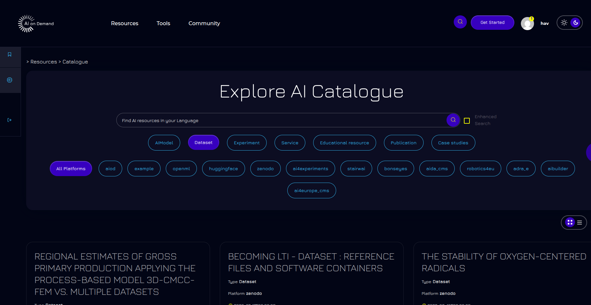
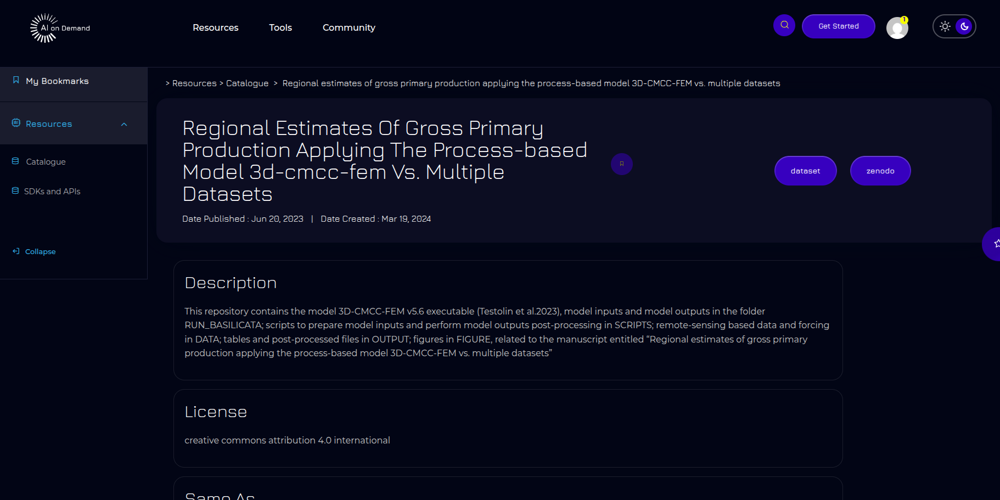
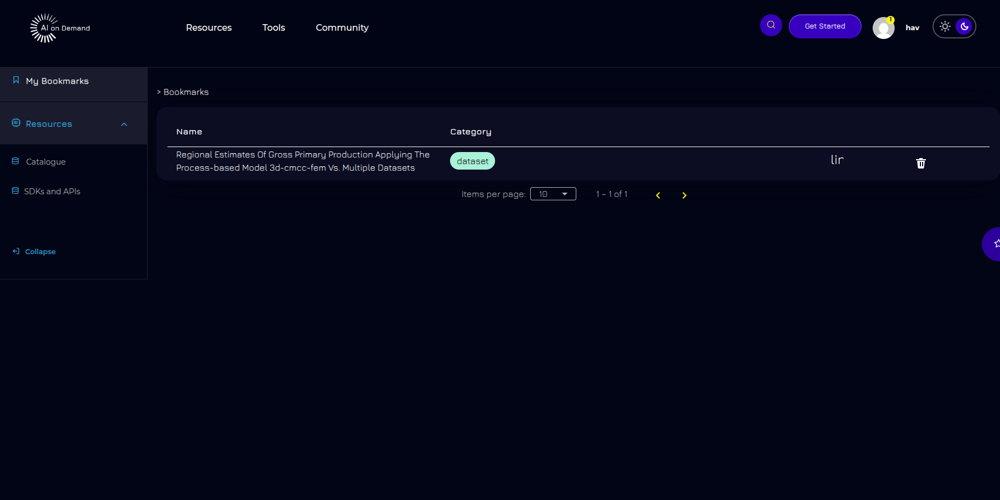
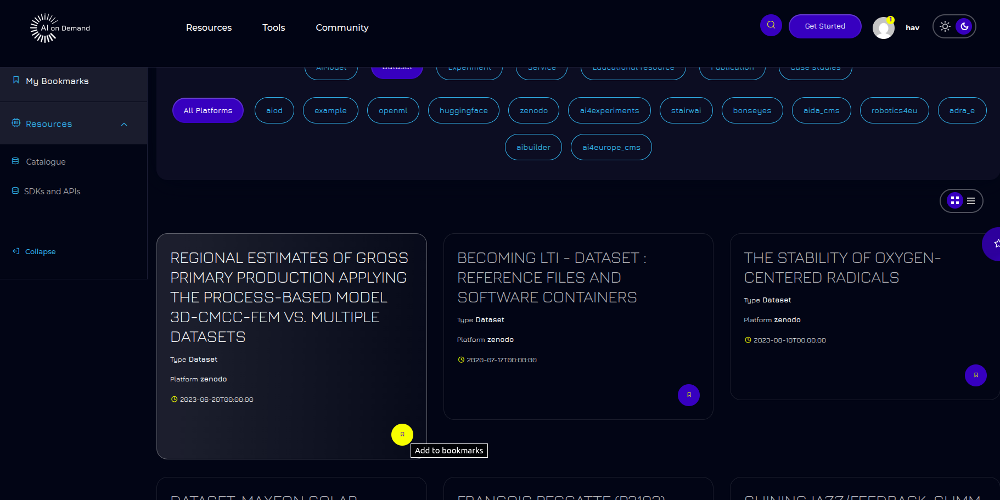

# AIoD My Library frontend


## Description

This is the repository of the _"AIoD My Library frontend"_ a service that allows users to browse technical AIoD assets such as datasets and experiments, and add them to their own library, so that they can quickly check them. 

More specifically, this service consists of a graphical user interface allowing users to:
- Filter assets from the AIoD Catalogue by their platform and asset category.
- Search in the AIoD Catalogue to retrieve those assets that include certain words or text
- View detailed information on each asset
- Select and add assets to their library (requires authentication)

This service is intended to be used in conjunction with other AIoD services, namely:
- The [Marketplace backend](https://github.com/aiondemand/AIOD-marketplace-backend), which provides the necessary functionality to manage all the information regarging the user's library.
- The [AIoD REST API](https://github.com/aiondemand/AIOD-rest-api), to retrieve information from te AIoD Catalogue and for user's authentication and authorisation.

 ### Pre-commit Hook

 Please run the script to perform the husky install.
```
 npm run prepare
```
- **Purpose**: Runs ESLint to check code quality before allowing commits
- **Location**: `.husky/pre-commit`
- **Command**: `npm run lint`
### Fixing lint error with the console

- **Purpose**: Automatically fix code style and formatting issues detected by ESLint and Prettier.
- **How to use**:  
  Run the following commands in the root of the project to automatically fix formatting and lint errors:

  ```bash
  npx prettier --write .
  npm run lint -- --fix
  ```

  - The first command (`npx prettier --write .`) formats all files in the project according to your Prettier configuration.
  - The second command (`npm run lint -- --fix`) attempts to automatically fix lint errors detected by ESLint.

- **Tip**:  
  If you want to fix a specific file, you can specify its path, for example:

  ```bash
  npx prettier --write src/environments/environment.local.ts
  ```

- **Recommendation**:  
  It is good practice to run these commands before

### Commit Message Hook

- **Purpose**: Validates that commit messages follow the [Conventional Commits](https://www.conventionalcommits.org/) specification
- **Location**: `.husky/commit-msg`
- **Tool**: Uses [@commitlint/config-conventional](https://github.com/conventional-changelog/commitlint/tree/master/@commitlint/config-conventional)

## Conventional Commit Format

Commit messages must follow this format:

```
<type>[optional scope]: <description>

[optional body]

[optional footer(s)]
```

### Types

- `feat`: A new feature
- `fix`: A bug fix
- `docs`: Documentation only changes
- `style`: Changes that do not affect the meaning of the code (white-space, formatting, missing semi-colons, etc)
- `refactor`: A code change that neither fixes a bug nor adds a feature
- `perf`: A code change that improves performance
- `test`: Adding missing tests or correcting existing tests
- `build`: Changes that affect the build system or external dependencies
- `ci`: Changes to our CI configuration files and scripts
- `chore`: Other changes that don't modify src or test files
- `revert`: Reverts a previous commit

### Examples

```bash
feat: add user authentication
fix: resolve memory leak in data processing
docs: update installation instructions
style: format code according to style guide
refactor: extract user validation logic
```

## Visuals










## Configuration and Deployment

Configuration and deployment instructinos are provided in more detailed in files:
* [deployment.en.md](./deployment.en.md) (english version)
* [deployment.es.md](./deployment.es.md) (spanish version)
 

## Support
If you would like to report bugs or any other suggestion/feedback, please, open an issue in this repository.
 
## Authors and acknowledgment
 
This project uses the AI4OS ["AI4 Dashboard" project](https://github.com/ai4os/ai4-dashboard) as a base.
Some functionalities have been ommited, and some others have been adapted to AIoD's purposes. In addition, some new functionalities have been added to address requirements of the AIOD platform. 

Adaptation of the AI4 Dashboard project and implementation of new features have been developed by:

* Danilo Salaz
* Pilar Piqueres (ppiqueres@iti.es)
* Sonia Santiago (ssantiago@iti.es)

